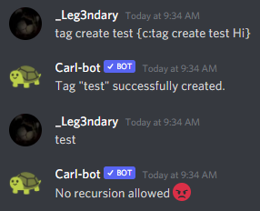

Limits
======

There are many limits in tagscript, and some more when you use Carl.

Loops
-----

You will not have access to loops in any way, there are a few exceptions, but in general if you want to loop through values and edit them, that won't be possible.

Examples of blocks that you can use that have loop-like features:

.. code:: ansi

    {replace}
    {join}
    b'\x1b[34;41;01m"\x1b[39;49;00m\x1b[34;41;01mHello World\x1b[39;49;00m\x1b[34;41;01m"\x1b[39;49;00m'

Tag Recursion
-------------

If you're looking to save data through tag recursion by using ``tag add`` sadly this will not work, you'll get the following message

Accessing Other Users Data
--------------------------

You will only be able to access 2 different users when using tags, and you must ping at least one of them.

