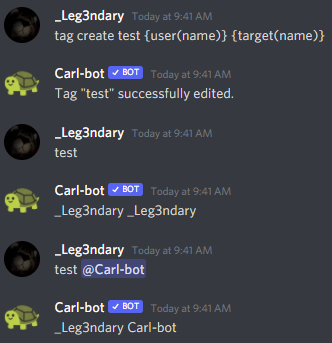

Limits
======

There are many limits in tagscript, and some more when you use Carl.

Loops
-----

You will not have access to loops in any way, there are a few exceptions, but in general if you want to loop through values and edit them, that won't be possible.

Examples of blocks that you can use that have loop-like features:

.. tagscript::

    {replace}
    {join}

Tag Recursion
-------------

If you're looking to save data through tag recursion by using ``tag add`` sadly this will not work, you'll get the following message

Accessing Other Users Data
--------------------------

You will only be able to access 2 different users when using tags, and you must ping at least one of them.

.. raw:: html

    <meta property="og:title" content="Tagscript Unofficial Docs" />
    <meta property="og:type" content="Site Content" />
    <meta property="og:url" content="https://tagscript-docs.readthedocs.io/en/latest/index.html" />
    <meta property="og:site_name" content="By _Leg3ndary#5759">
    <meta property="og:image" content="https://i.imgur.com/AcQAnss.png" />
    <meta property="og:description" content="The unofficial but better docs for Carl-bots Tagscript, not affiliated with Botlabs or Carl-bot" />
    <meta name="theme-color" content="#2980B9">