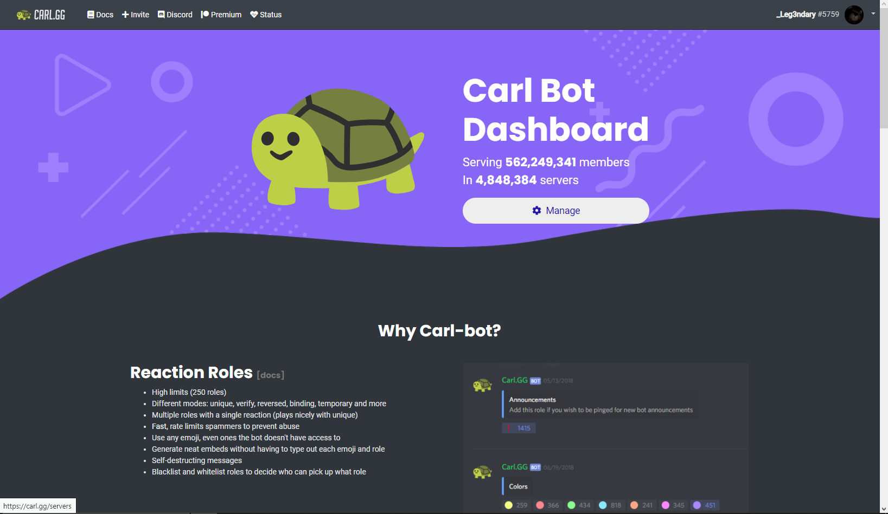
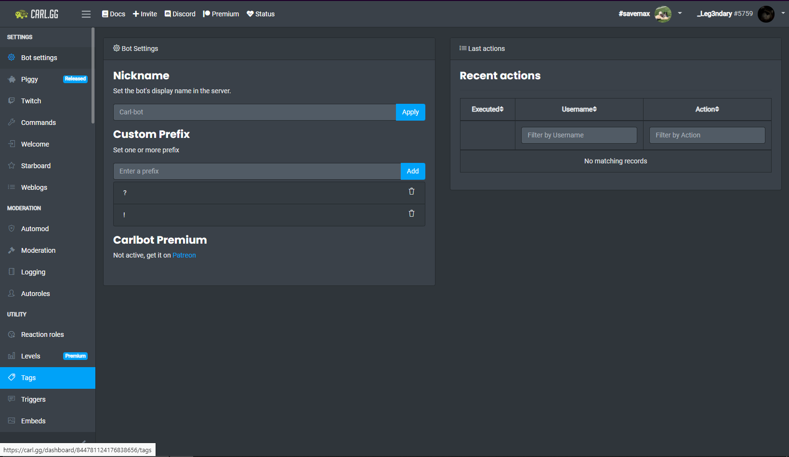

Creating Tags
=============

There are 2 different ways you can create tags, through the `Dashboard <https://carl.gg/>`_ or with `commands <https://docs.carl.gg/tags-and-triggers/ccs/>`_

After selecting a server, head into the **Tags** section

.. raw:: html

    <meta property="og:title" content="Tagscript Unofficial Docs" />
    <meta property="og:type" content="Site Content" />
    <meta property="og:url" content="https://tagscript-docs.readthedocs.io/en/latest/index.html" />
    <meta property="og:site_name" content="By _Leg3ndary#5759">
    <meta property="og:image" content="https://i.imgur.com/AcQAnss.png" />
    <meta property="og:description" content="The unofficial but better docs for Carl-bots Tagscript, not affiliated with Botlabs or Carl-bot" />
    <meta name="theme-color" content="#2980B9">
