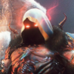

Credits
=======

Ignore this for now :) I will add this when everything else is all finished

.. note::

    If you've contributed before, feel free to add your username/other info here

.. |person1| image:: images/_Leg3ndary.png
    :alt: Image Failed Loading.

.. |person2| image:: images/default.png
    :alt: Image Failed Loading.

If you know how to fix this please help me, and add your name here

.. table:: Credits
    :align: center

    +-----------------------------------------------------------------------+--------------------+------------------------------------------+
    | |person1|                                                             | |person2|          | |person3|                                |
    +-----------------------------------------------------------------------+--------------------+------------------------------------------+
    | _Leg3ndary#5759 Original Creator of these docs                       | This could be you  | Raffael#1372 Has many tags and snippets  |
    +-----------------------------------------------------------------------+--------------------+------------------------------------------+

.. raw:: html

    <meta property="og:title" content="Tagscript Unofficial Docs" />
    <meta property="og:type" content="Site Content" />
    <meta property="og:url" content="https://tagscript-docs.readthedocs.io/en/latest/index.html" />
    <meta property="og:site_name" content="By _Leg3ndary#5759">
    <meta property="og:image" content="https://i.imgur.com/AcQAnss.png" />
    <meta property="og:description" content="The unofficial but better docs for Carl-bots Tagscript, not affiliated with Botlabs or Carl-bot" />
    <meta name="theme-color" content="#2980B9">